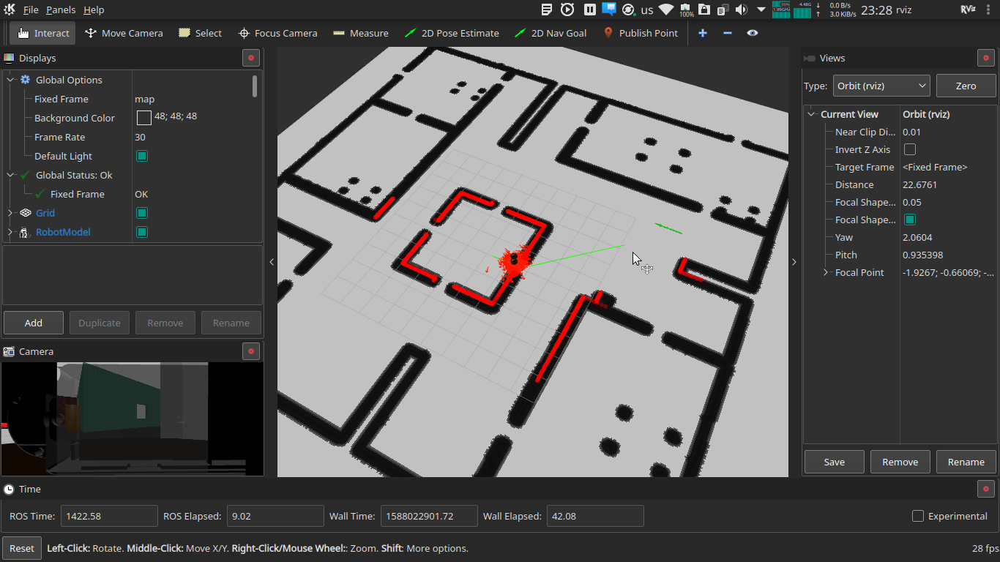
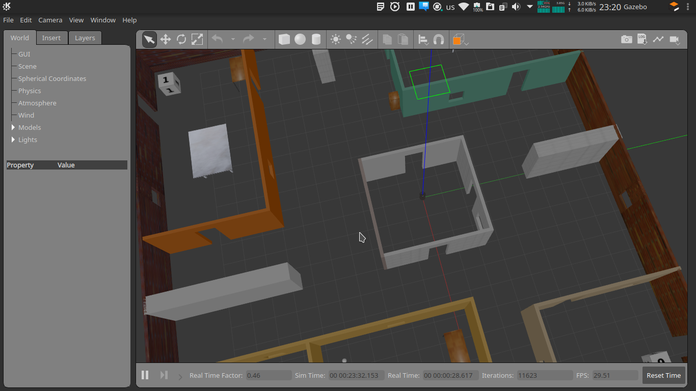

# Betabot Localization and Navigation

- [Betabot Localization and Navigation](#betabot-localization-and-navigation)
  - [Project Description](#project-description)
  - [GUID](#guid)
  - [Project Rubric](#project-rubric)
  - [After you implement the pkg state your reflection below](#after-you-implement-the-pkg-state-your-reflection-below)
  - [Part I: Map (map_server)](#part-i-map-mapserver)
    - [In your own words how maps are represented in ROS?](#in-your-own-words-how-maps-are-represented-in-ros)
    - [State 5 algorithm for SLAM and the ROS implementation](#state-5-algorithm-for-slam-and-the-ros-implementation)
  - [Part II: Localization (amcl)](#part-ii-localization-amcl)
    - [In your own words how amcl works?](#in-your-own-words-how-amcl-works)
    - [Is there other better approaches to localize your robot rather than amcl?](#is-there-other-better-approaches-to-localize-your-robot-rather-than-amcl)
    - [What are the amcl limitations or the fail cases?](#what-are-the-amcl-limitations-or-the-fail-cases)
    - [Is amcl used in domain rather than Robotics?](#is-amcl-used-in-domain-rather-than-robotics)
  - [Part III: Navigation (move_base)](#part-iii-navigation-movebase)
    - [How many official local planner available in ROS?](#how-many-official-local-planner-available-in-ros)
    - [which local planner did you use?](#which-local-planner-did-you-use)
    - [In your own words how the local planner you selected works?](#in-your-own-words-how-the-local-planner-you-selected-works)
    - [How many official global planner available in ROS?](#how-many-official-global-planner-available-in-ros)
    - [which global planner did you use?](#which-global-planner-did-you-use)
    - [In your own words how the global planner you selected works?](#in-your-own-words-how-the-global-planner-you-selected-works)
    - [State your suggestion increase the overall performance?](#state-your-suggestion-increase-the-overall-performance)
    - [List the most time consuming problems you faced](#list-the-most-time-consuming-problems-you-faced)
    - [Demos](#demos)
    - [Screenshots](#screenshots)
      - [NAME:](#name)
      - [ID:](#id)

## Project Description 

Create a ROS package with custom launch files to localize the robot in an environment given the map and also to autonomous navigation. 

*Use the given [map](map/map2d.yaml) for the myoffice world [here](../betabot_gazebo/worlds/myoffice.world)* 

   
  

>NOTE: For the given map and a world the betabot robot should localize it self and move from currant pose to a given goal autonomously

## GUID
Follow where am I project from Udacity Software Robotics Engineer Nanodegree.

---
## Project Rubric

 

---

## After you implement the pkg state your reflection below 

---
## Part I: Map (map_server)

###  In your own words how maps are represented in ROS?
They are presented as PGM images, that have in the basic case values 0 and 255. They indicate whether theres an obsatcle or not. 
###  State 5 algorithm for SLAM and the ROS implementation

| SLAM Algorithm | ROS implementation |
|:--------------:|:------------------:|
|     GMapping   |      gmapping      |
|  tinySLAM      |   slam_constructor |
|  vinySLAM      |   slam_constructor |
|  mono-SLAM     |        https://github.com/rrg-polito/mono-slam           |
|        Cartographer        |     cartographer               |

---

## Part II: Localization (amcl)

### In your own words how amcl works?

It works by drawing particles from the probability distribution of the estimated position and then updates itself by selecting the most accurate particles then refining the probability distribution. ALbeit in a continuos fashion until the particles converge around the actual location.

### Is there other better approaches to localize your robot rather than amcl?

SLAM, because it does not need a map.

### What are the amcl limitations or the fail cases?

It fails if the provided map is not accurate. 

### Is amcl used in domain rather than Robotics?
MCMC: Markov chain Monte Carlo is an important statistical methods in simulations and modelling in Physics and many sciences. 
---

## Part III: Navigation (move_base)

### How many official local planner available in ROS?
base_local_planner, carrot_planner and dwa_local_planner
### which local planner did you use?
base_local_planner
### In your own words how the local planner you selected works?
Given the global plan the local planner decides how to adhere and move according to that plan on the local scale/map.
### How many official global planner available in ROS?
1 global_planner
### which global planner did you use?
global_planner
### In your own words how the global planner you selected works?
The global planners decides on a path to follow from the current position to the planned goal.

---

### State your suggestion increase the overall performance?
Further tuning of  the parameters.
### List the most time consuming problems you faced
Tuning the parameters
---

### Demos
Add unlisted youtube/drive videos

[Demo](https://youtu.be/MUvWQHpdoZI)

### Screenshots
1. rviz with all navigation launchers from turtulbot

2. gazebo

---

#### NAME: Mohamed Adham Mahrous
#### ID: 20160178

---
